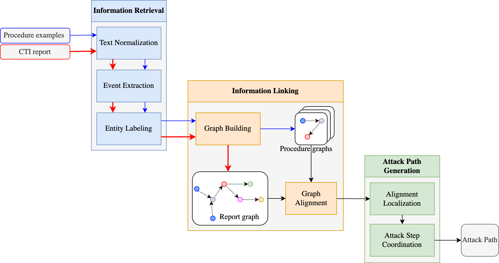
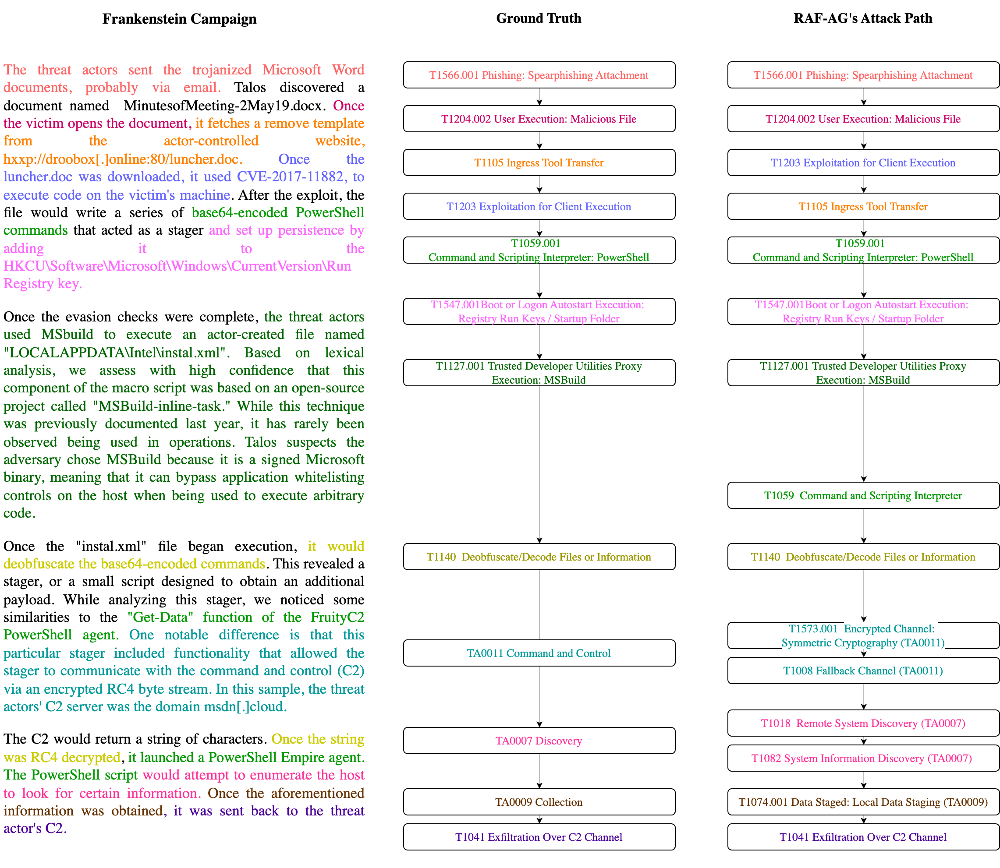

# RAF-AG: Report Analysis Framework for Automatic Attack Path Generation

This repository contains the code for RAF-AG, a powerful framework designed for generating attack paths based on Cyber Threat Intelligence (CTI) reports. RAF-AG offers several key features:

1. Generate attack paths for input CTI reports.
2. Follow the sequential order of information presented in CTI reports, enabling a better understanding of causal relationships.
3. Output attack paths that include MITRE ATT&CK technique IDs, facilitating future analysis of these reports.
An overview of RAF-AG is shown in the figure below. In RAF-AG, text data from MITRE ATT&CK (e.g., procedure examples) are transformed into graphs (the blue path). The graphs will establish the knowledge base of the framework. RAF-AG takes CTI reports as its main inputs. These CTI reports will also be transformed into graph (the red path).
To analyze a specific report and generate its attack path (the black path), we conduct a graph alignment between the report graph and the framework's internal graphs. After that, the graph alignment results will be decoded into the attack paths. 

Example of input and output of the framework:

## Prerequisites

To ensure smooth execution, please follow these prerequisites:

- The source code is written in Python. We recommend creating a virtual environment to prevent conflicts with existing libraries on your system.
- Install the required libraries by running the following command:

```bash
pip install -r /path/to/requirements.txt
```

- Download the pretrained language models for SpaCy. Both the `web_lg` and `web_tft` models are required. Use the following commands:

```bash
python -m spacy download en_core_web_lg
python -m spacy download en_core_web_trf
```

- Install the Coreferee library to extract coreferences in text:

```bash
python -m coreferee install en
```

## Quick Start

To start using RAF-AG, follow these steps:

1. Place your CTI reports (each in a .txt format) in the `data/campaign/input` folder.
2. Run the following command:

```bash
python3 main.py
```

3. Once the analysis is complete, you can find the results in the `data/campaign/decoding_result` folder. Each report's results can be identified by its corresponding ID.

## Code Hierarchy

RAF-AG is implemented using an object-oriented programming approach. The repository structure includes the following main folders and classes:

- `classes`: Contains classes for different components of the framework, such as `Sentence`, `Paragraph`, `Procedure`, `Campaign`, and more.
- `preprocessings.py`: Provides functions for text preprocessing.
- `subject_verb_object_extraction.py`: Contains Python functions that represent grammar rules used to extract relations from sentence dependency trees.
- `cosine_similarity.py`: Includes functions for extracting phrase embeddings and calculating cosine similarity.

## Data Hierarchy

The repository includes different types of data folders that you need to consider:

- `data/campaign`: Contains input and output data related to CTI reports, including the input reports themselves, graph data, alignment results, and decoding results.
- `data/procedure`: Stores raw data from ATT&CK, including procedure examples, graph data, and deduplicated graph data.
- `data/meta data`: Contains meta data used in different stages of RAF-AG, including verb similarity data.
- `data/patterns`: Includes generic regex patterns for working with ATT&CK-specific data.
- `data/dictionarydata`: Stores dictionary data for the weak supervision approach in RAF-AG, with each JSON file representing a specific category.

## Acknowledgements

This is a code repo for RAF-AG paper. RAF-AG is a framework suitable for generating attack paths for Cyber Threat Intelligence report.
Some usage of RAF-AG:
- 1. Generate attack paths for input CTI reports
- 2. The attack path follows the sequential order of information presented in CTI reports. While this is not true for all report, sequential order allows the understanding of causal relationship
- 3. The output attack path contains a list of MITRE ATT&CK's technique ID. Which is useful for future analysis of these reports


## Prerequisites
- The source code is written in Python language. A virtual env should be created to prevent conflicts with existing libraries in your system.
- Install library from requirements.txt. 
```bash
pip install -r /path/to/requirements.txt
```
- Download the pretrained language models for SpaCy to work. Both the language models (web_lg and web_tft ) are required to work.
```bash
python -m spacy download en_core_web_lg
python -m spacy download en_core_web_trf
```
- Install the Coreferee library to extract coreferences in text
```bash
python -m coreferee install en
```
## Quick Start
To start using the framework, simply put your CTI reports (each in a txt format) in the data/campaign/input folder. After that, simply run:
```bash
python3 main.py
```
When the analysis is done, look for the results in data/campain/decoding_resutl. We consider the name of the input CTI reports to be its ID. We will find the corresponding results for each report by looking for its name.

## Code Hierrachy
The RAF-AG is implemented using object oriented programming approach. There are main folders and classes:
- classes: 
    - sentence.py: This class is used to present a Sentence object. Each sentence will be analysze using the sentence dependency tree to extract the cybersecurity events
    - paragraph.py: This class is used to present a Paragraph object, containing a list of Sentences
    - procedure.py: This class is used to present a procedure example from MITRE ATT&CK framwork, inheriting from paragraph
    - campaign.py and bigcampaign.py: These classes are used to present a campaign, which is a CTI report.
    - preprocessings.py: This file contains functions for preprocessing the text
    - subject_verb_object_extraction: This file contains a list of Python functions, each present a grammar rules. These functions are used to traverse the sentence dependency tree to extract the relations.
    - consine_similarity.py: This file contains functions to extract the embeddings of phrases and calculate the cosine similarity between them.
- data: Data used in the framework. This is also the place for user to input new CTI reports for analyzing. The data hierrachy will be explained in the next section.
- keys.py: Hyperparameters of RAF-AG. This is where the users can customize the hyperparameters of the framework
- language_models.py: Prepare the lanauge_models before it can be used in RAF-AG
- mitre_attack.py: This script is used to read the ATT&CK STIX data and extract the require information (e.g, techniques, procedure examples)
- modules and utils: supporting modules and utils

## Data Hierrachy
There are different types of data folders you need to consider before you can run the code:
- data/campaign: 
    - input: where the input CTI reports are stored. To keep it simple, each CTI report will be saved in a single text file (*.txt). The name of the file is also the ID of the report
    - output: Where the graph data for the input CTI report is stored. Each CTI will be transformed into a graph and stored in jsonl format. 
    - procedure_alignment: This is the raw alignment results between the report graph and procedure graphs
    - decoding_result: This is the attack paths for CTI reports.
- data/procedure:
    - input: Where the raw data from ATT&CK is stored. We saved it in a single procedures.json file, containing all the procedure examples from ATT&CK. Main data for each procedure example contains: technique ID, platforms, and description.
    - output: Where the graph data for procedure examples are stored. In this folder, each procedure graph is stored as a single json file.
    - deduplication: Where the graph data for procedure examples are stored. However, this graph data is deduplicated, similar procedure graphs (within same technique) will be merge into one
    - analyzed_procedure.jsonl: All the data contained in data/procedure/deduplication are converted into a single jsonline file for faster import into the framework
- data/meta data: Some meta data used for different stages of RAF-AG. The most important is the verb_similarity data
- data/patterns: some generic regex patterns to work with ATT&CK-specific data. This is used for automatically extract keywords, special phrases from ATT&CK
- data/dictionarydata: This is the dictionary data for the weak supervision approach in RAF-AG. Each json file is used for one specific category (e.g., Actor.json)

## Acknowledgements
