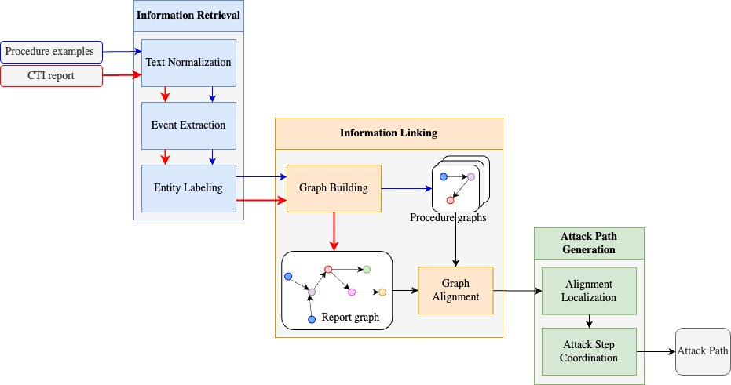
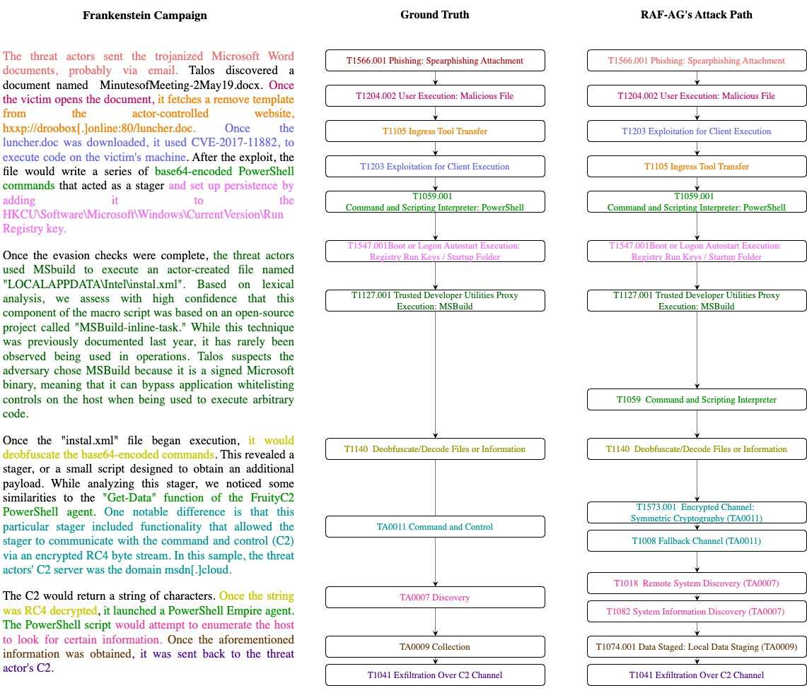

# RAF-AG: Report Analysis Framework for Automatic Attack Path Generation

This repository contains the code for RAF-AG, a powerful framework designed for generating attack paths based on Cyber Threat Intelligence (CTI) reports. RAF-AG offers several key features:

1. Generate attack paths for input CTI reports.
2. Follow the sequential order of information presented in CTI reports, enabling a better understanding of causal relationships.
3. Output attack paths that include MITRE ATT&CK technique IDs, facilitating future analysis of these reports.
The figure below shows an overview of RAF-AG. In RAF-AG, text data from MITRE ATT&CK (e.g., procedure examples) are transformed into graphs (the blue path). The graphs will establish the framework's knowledge base. RAF-AG takes CTI reports as its main input. These CTI reports will also be transformed into graphs (the red path).
To analyze a specific report and generate its attack path (the black path), we conduct a graph alignment between the report graph and the framework's internal graphs. After that, the graph alignment results will be decoded into the attack paths. 

Example of input and output of the framework:


## Prerequisites
- The source code is written in Python language. A virtual env should be created to prevent conflicts with existing libraries in your system.
- Install library from requirements.txt. 
```bash
pip install -r /path/to/requirements.txt
```
- Download the pre-trained language models for SpaCy to work. Both the language models (web_lg and web_tft ) are required to work.
```bash
python -m spacy download en_core_web_lg
python -m spacy download en_core_web_trf
```
- Install the Coreferee library to extract coreferences in text
```bash
python -m coreferee install en
```
- There are data files in zip format (see `./data` folder) that contain necessary data for running the framework. Unzip these *.zip files directly to the `./data` folder. For example, after unzipping `data/procedure.zip`, you should see a new folder `data/procedure/` containing procedure data.

## Quick Start
To start using the framework, simply put your CTI reports (each in a txt format) in the data/`campaign/input` folder. 

After that, simply run:
```bash
python3 main.py
```
When the analysis is done, look for the results in data/campain/decoding_resutl. We consider the name of the input CTI reports to be its ID. We will find the corresponding results for each report by looking for its name.

## Code Hierarchy
The RAF-AG is implemented using an object-oriented programming approach. There are main folders and classes:
- `classes`: 
    - `sentence.py`: This class is used to present a Sentence object. Each sentence will be analyzed using the sentence dependency tree to extract the cybersecurity events
    - `paragraph.py`: This class is used to present a Paragraph object containing a list of Sentences
    - `procedure.py`: This class is used to present a procedure example from MITRE ATT&CK framework, inheriting from paragraph
    - `campaign.py` and `bigcampaign.py`: These classes are used to present a campaign, which is a CTI report.
    - `preprocessings.py`: This file contains functions for preprocessing the text
    - `subject_verb_object_extraction.py`: This file contains a list of Python functions, each presenting grammar rules. These functions are used to traverse the sentence dependency tree to extract the relations.
    - `consine_similarity.py`: This file contains functions to extract the embeddings of phrases and calculate the cosine similarity between them.
- `data`: Data used in the framework. This is also the place for users to input new CTI reports for analysis. The data hierarchy will be explained in the next section.
- `keys.py`: Hyperparameters of RAF-AG. This is where the users can customize the hyperparameters of the framework
- `language_models.py`: Prepare the lanauge_models before it can be used in RAF-AG
- `mitre_attack.py`: This script is used to read the ATT&CK STIX data and extract the required information (e.g, techniques, procedure examples)
- `modules` and `utils`: supporting modules and utils

## Data Hierrachy
There are different types of data folders you need to consider before you can run the code:
- `data/campaign`: 
    - `input`: where the input CTI reports are stored. To keep it simple, each CTI report will be saved in a single text file (*.txt). The name of the file is also the ID of the report
    - `output`: Where the graph data for the input CTI report is stored. Each CTI will be transformed into a graph and stored in jsonline format. 
    - `procedure_alignment`: This is the raw alignment results between the report graph and procedure graphs
    - `decoding_result`: This is the attack paths for CTI reports.
- `data/procedure`:
    - `input`: Where the raw data from ATT&CK is stored. We saved it in a single procedures.json file, containing all the procedure examples from ATT&CK. The main data for each procedure example contains technique ID, platforms, and description.
    - `output`: Where the graph data for procedure examples are stored. Each procedure graph is stored in this folder as a single json file.
    - `deduplication`: Where the graph data for procedure examples are stored. However, this graph data is deduplicated; similar procedure graphs (within the same technique) will be merged into one
    - `analyzed_procedure.jsonl`: All the data contained in data/procedure/deduplication are converted into a single jsonline file for faster import into the framework
- `data/meta data`: Some meta data used for different stages of RAF-AG. The most important is the verb_similarity data
- `data/patterns`: some generic regex patterns to work with ATT&CK-specific data. This is used to automatically extract keywords, and special phrases from ATT&CK
- `data/dictionarydata`: This is the dictionary data for the weak supervision approach in RAF-AG. Each json file is used for one specific category (e.g., Actor.json)
## Dataset
The dataset (Dataset.zip) includes 30 CTI reports that are collected from various CTI sources. We also include the ground truth data, which are generated by a cybersecurity expert.
## Acknowledgements
